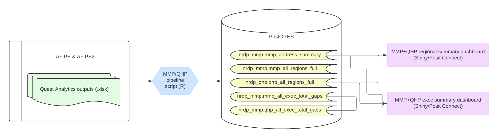

Data pipeline
================

## Purpose

This README documents the pipeline used to serve data to the
[Regional](https://github.kp.org/AKME/nrdp-qhp-regional-dashboard)
and [Executive
Summary](https://github.kp.org/AKME/nrdp-qhp-monitoring)
Monitoring apps.

## Workflow

In general, this pipeline reads in data from Quest Analytics outputs
(.xlsx), makes necessary transformations, and uploads them to a set of
dedicated PostGRES tables.

